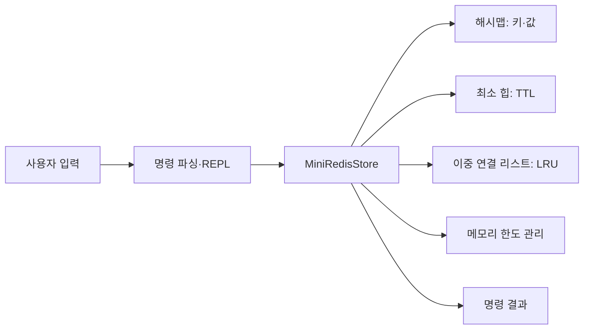

# 자료구조 기반 미니 Redis

## 프로젝트 소개

Python으로 직접 구현한 해시맵, 최소 힙, 이중 연결 리스트를 사용하는 메모리 키·값 저장소입니다. 빠른 조회, TTL 만료, LRU 제거가 자료구조와 어떻게 연결되는지 살펴보는 실습입니다.

## 핵심 특징

- `SET`, `GET`, `DEL`, `EXISTS`, `DBSIZE`, `KEYS`
- `EXPIRE`, `TTL`을 이용한 만료 관리
- 설정한 메모리 한도에 따른 LRU 제거
- 채널 구독 상태와 발행 결과를 다루는 Pub/Sub 명령
- 동적 배열·해시맵·힙·연결 리스트·트리의 직접 구현

## 아키텍처

`사용자 입력 → MiniRedisCLI → MiniRedisStore → 자료구조` 흐름입니다. 키와 메타데이터는 해시맵에, 만료 우선순위는 힙에, 최근 사용 순서는 이중 연결 리스트에 저장합니다.

| 경로 | 역할 |
| --- | --- |
| `src/mini_redis/__main__.py` | REPL 실행 진입점 |
| `src/mini_redis/cli.py` | 명령 파싱과 출력 |
| `src/mini_redis/store.py` | 저장·만료·메모리 제한·LRU 관리 |
| `src/mini_redis/structures/hash_map.py`, `linked_list.py`, `min_heap.py` | 핵심 자료구조 |
| `src/mini_redis/structures/dynamic_array.py`, `tree.py` | 추가 자료구조 구현 |
| `docs/design.md` | TTL·LRU·메모리 한도의 설계 결정 |



소스는 `src/mini_redis/`, 회귀 테스트는 `tests/`, 개발 보조 도구는 `scripts/`에 둡니다. `pyproject.toml`이 패키지·명령·개발 도구를 선언하고 `uv.lock`이 설치 버전을 고정합니다. `uv sync --frozen`은 소스를 개발 모드로 설치하므로 앱 실행과 테스트에 별도 `PYTHONPATH` 설정이 필요하지 않습니다.

## 실행 환경과 시작하기

Python 3.10 이상과 uv를 사용합니다. 앱 런타임은 표준 라이브러리만 사용합니다. 저장소 루트에서 실행합니다.

```bash
uv sync --frozen
uv run --frozen mini-redis
```

```text
SET name redis
GET name
EXPIRE name 10
TTL name
QUIT
```

## 동작 범위

데이터는 프로세스 메모리에 저장되어 종료하면 사라집니다. TCP 서버·디스크 영속 저장·분산 처리를 제공하지 않습니다. 만료 정리는 명령 실행 시 수행하며, 메모리 계산은 구현에서 정한 추정치입니다. Pub/Sub는 네트워크 메시지 전달 서비스가 아닌 채널 상태 실습입니다.

## 검증

```bash
make check
make test
make smoke
make build
```

별도 프로세스에 명령을 전달해 저장·조회·만료 설정·삭제·종료를 확인합니다. 임의의 대기나 외부 서비스를 사용하지 않습니다.

`make check`는 정적 분석·포맷·문서 검사를, `make test`는 `uv run --frozen pytest -q`로 전체 동작 검사를 실행합니다. `make smoke`는 같은 테스트 중 `smoke` 마커가 붙은 실행 확인만 선택합니다(`uv run --frozen pytest -q -m smoke`). 테스트는 `test_*.py`와 fixture로 구성하며 임시 DB·파일과 모의 요청을 사용합니다.

## 상세 문서

[저장소 설계](docs/design.md)에서 자료구조 선택, 만료 처리와 메모리 계산 기준을 설명합니다.
